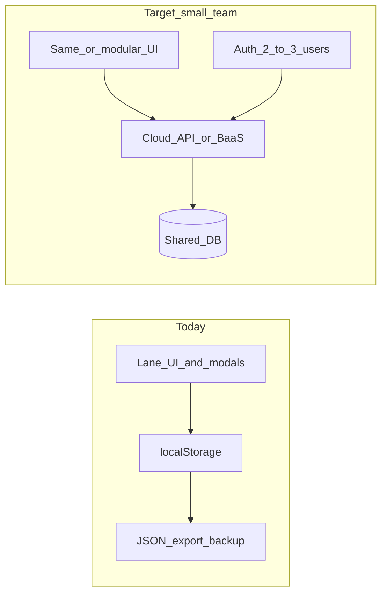
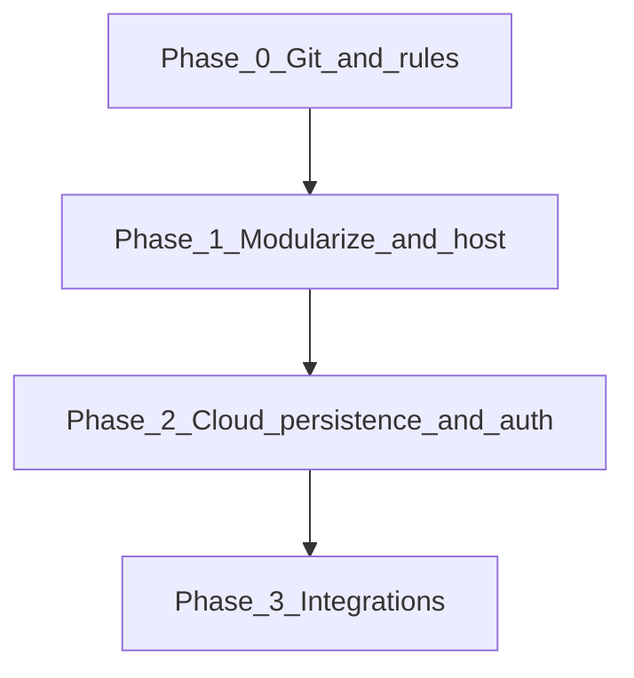

# 100UP CRM — Extension Options Assessment

## What exists today

| Aspect | Detail |
|--------|--------|
| App | [`100UP_stock-crm_V10.html`](100UP_stock-crm_V10.html) — ~115 KB, ~1,833 lines, ~66 functions, inline CSS/JS |
| Data | Browser `localStorage` keys: `100up_v2`, `100up_nid`, `100up_stocks`, `100up_snid` |
| Backup | JSON export/import (`jobs`, `stocks`, `nextId`, `stockNextId`) — see sample [`100UP_stock-crm_2026-05-29.json`](100UP_stock-crm_2026-05-29.json) (~15 KB) |
| Network | None — no `fetch()`, no auth, no sync |
| UI | Highly custom 17-step lane/pipeline grid — not a generic CRUD app |
| Outputs | Clipboard-first (CES HTML tables, PO parts lists, job details) — compliance workflow is embedded in JS |
| Integrations | Xero mentioned in pipeline steps only; no API. [`CLAUDE.md`](CLAUDE.md) already flags Supabase and Xero as open items |

**Core persistence today** (everything else hangs off this):

```719:736:100UP_stock-crm_V10.html
function saveData(){
  localStorage.setItem('100up_v2',JSON.stringify(jobs));
  localStorage.setItem('100up_nid',nextId);
  localStorage.setItem('100up_stocks',JSON.stringify(stocks));
  localStorage.setItem('100up_snid',stockNextId);
  toast('Saved!');
}

function loadData(){
  const s=localStorage.getItem('100up_v2');
  // ...
}
```

**Implication:** Any serious “not tied locally” path replaces or wraps `saveData`/`loadData` — the UI can largely survive if the data layer is swapped cleanly.



---

## Your constraints (from discussion)

- **Users:** 2–3 people on shared live data (not solo sync-only)
- **Fred iteration:** Critical, but **not** tied to one HTML file — git repo is his; safe deploy/test + clear “Fred zone vs collaborator zone”
- **Collaboration:** You help with integrations; Fred handles capable tweaks (new fields, catalog entries, simple relationships)
- **AI efficiency:** Smaller, scoped context for both CRM-user AI features and development

---

## Option 1 — Supabase BaaS + modular frontend (recommended default)

**Shape:** Split the monolith into a small static frontend (still no heavy build step if desired) + Supabase (Postgres, Auth, Row Level Security, optional Edge Functions for Xero OAuth).

**What changes:**
- Tables mirror current JSON: `jobs`, `stocks`, sequences for `next_id` / `stock_next_id`
- Replace `saveData`/`loadData` with Supabase client calls (or a thin `data.js` module Fred rarely touches)
- Auth: email login for Fred + installer/office; RLS so all staff see same jobs or role-scoped views later
- Xero: Edge Function holds OAuth secrets; CRM calls your function, not Xero directly

**Fred’s safe zone:**
- `CES_CATALOG` and stock name mappings (today ~line 1354)
- New job/stock fields: migration SQL or Supabase table editor + one UI row in `detail` templates
- Pipeline step labels in `PIPELINE` constant

**Your zone:**
- RLS policies, Edge Functions, Xero/webhook integrations, deployment

**Pros:** Fastest path to shared DB + auth; already on roadmap; realtime optional; free tier viable at this data size  
**Cons:** SaaS dependency; Fred needs light Supabase familiarity for schema changes; breaks “zero external JS” unless you accept `supabase-js` from CDN

**AI token efficiency:** Repo becomes `frontend/` (modules ~100–300 lines each) + `supabase/migrations/` + `docs/SCHEMA.md` — AI sessions target one module, not 1,833 lines. Future “CRM user AI” can pull **one job row + stock context** from API, not parse localStorage.

**Fit score:** High for 2–3 users, integrations, and git-based collaboration.

---

## Option 2 — VPS API on existing stack (CyberPanel / LiteSpeed) — no Docker required

**Shape:** Static HTML/JS on `crm.100up...` + small API (PHP in MU-plugin style, or Node behind reverse proxy) + Postgres or MySQL on the VPS.

**What changes:**
- REST endpoints: `GET/PUT /jobs`, `GET/PUT /stocks`, etc.
- Session or JWT auth (2–3 users)
- Nightly JSON export cron on server (replaces manual Export button as safety net)

**Docker variant:** Optional `docker-compose` (API + Postgres) on a VPS if you want reproducible dev/prod — **not required** on CyberPanel; useful if you want identical local staging for Fred.

**Pros:** Full control; aligns with your hosting muscle; no per-seat SaaS; secrets for Xero stay on server you manage  
**Cons:** You own backups, SSL, auth, migrations; more ops than Supabase; Fred shouldn’t touch server config

**AI token efficiency:** Similar modular frontend + `api/` folder with clear routes. Slightly more code than Supabase for auth/sync.

**Fit score:** High if long-term ownership on your infrastructure matters more than speed.

---

## Option 3 — Low-code data backend (NocoDB / Baserow / Airtable) + keep custom UI

**Shape:** Jobs/stocks live in NocoDB/Baserow (self-hosted on VPS or cloud). Custom lane UI stays; only persistence layer talks REST to the low-code API.

**Fred’s zone:** Add columns, relationships, views in NocoDB UI — closer to “spreadsheet with API”  
**Your zone:** Custom pipeline UI, CES/PO generators, integration glue

**Pros:** Fred can iterate schema without SQL; quick admin UI for stock counts; self-hosted NocoDB on VPS is feasible  
**Cons:** **Dual UI problem** — lane view stays custom; low-code UI becomes a second place to work; pipeline logic (17 steps, `doAdvance`, stock consumption) still lives in JS and doesn’t map to generic CRUD; Airtable SaaS pricing/limits at scale

**AI token efficiency:** Good for schema docs (exported from NocoDB); frontend modules still needed for bespoke UI.

**Fit score:** Medium — good if Fred wants a visual schema editor; weaker fit for the bespoke pipeline UX.

---

## Option 4 — Full framework rewrite (Next.js / Astro / SvelteKit) + API

**Shape:** Component-based app, typed models (`Job`, `StockItem`), server actions or API routes, deploy to Vercel/Cloudflare or VPS.

**Pros:** Best long-term for tests, types, integrations, and **development** AI context (small files, clear boundaries); easiest to add role-based UI later  
**Cons:** Largest upfront rewrite; Fred’s “tweak and reload” becomes `git pull` + build/deploy unless you set up preview URLs; highest learning curve for Fred unless changes are confined to config/data files

**Pragmatic variant:** Astro or Vite **multi-file** but still mostly vanilla JS in components — avoids React complexity for Fred.

**AI token efficiency:** Best for development tokens once split; worst short-term cost (rewrite).

**Fit score:** Medium-long term — right if you expect many integrations and roles; wrong as **first** move unless Fred accepts slower initial delivery.

---

## Option 5 — “CMS shell” (WordPress + custom plugin) — niche fit

**Shape:** WP on existing stack; custom plugin registers job/stock tables or uses custom post types; Breakdance for any marketing pages; CRM UI as admin page or front-end app.

**Pros:** You already run WP professionally; backup/update patterns Fred may know  
**Cons:** WP is a poor match for realtime lane UI, stock allocation math, and clipboard CES tables; plugin security surface; feels heavier than a thin API for this use case

**Fit score:** Low unless Fred explicitly wants CRM inside an existing 100UP WP site with shared login.

---

## What does *not* work well (avoid as primary strategy)

| Approach | Why skip |
|----------|----------|
| Hosted static file only | Multi-user still has divergent `localStorage` |
| Git-synced JSON file as “database” | No concurrent edits; conflict hell for 2–3 users |
| CSV / manual Xero import | Already ruled out in roadmap |
| Keeping single 1,833-line file forever | Blocks safe Fred edits and wastes AI/dev tokens on every change |

---

## AI token strategy (both “user” and “development”)

**Development tokens (you + Fred + Cursor):**
1. **Modularize early** — e.g. `pipeline.js`, `stock.js`, `ces.js`, `persistence.js`, `ui-lanes.js` (target &lt;300 lines each)
2. **`docs/SCHEMA.md`** — job/stock fields, pipeline rules, consumption rules — AI reads this instead of scraping HTML
3. **Cursor rules / `CONTRIBUTING.md`** — “Fred may edit: SCHEMA, CES_CATALOG, PIPELINE labels, form fields; collaborator: auth, API, migrations, Xero”
4. **Version badge** can stay — filename convention optional once git is source of truth

**CRM user tokens (if/when Fred uses AI inside the app):**
- Cloud-backed **per-job context** (one customer, allocated stock, dates) — small prompt, no codebase
- Server-side integration endpoints — AI suggests “copy to Xero” workflow, doesn’t embed API keys in browser
- Keep outputs clipboard-oriented (existing pattern) — no file-generation pipelines to debug

---

## Suggested phased path (low regret)



| Phase | Deliverable | Fred can… | You handle… |
|-------|-------------|-----------|-------------|
| **0** | Git repo, `CONTRIBUTING.md`, staging URL | Branch, test on staging, merge small UI tweaks | CI or simple deploy script |
| **1** | Split monolith + host static app | Edit catalog/fields in git modules | Module boundaries, reviews on `persistence.js` |
| **2** | Supabase **or** VPS API + 2–3 logins | Add columns with guided migration | RLS/auth, import existing JSON, cutover |
| **3** | Xero helper / OAuth | Use buttons in CRM | Edge Function / API, token refresh |

**First concrete technical step:** Extract `saveData`/`loadData` behind `PersistenceAdapter` — `LocalStorageAdapter` (current) and `RemoteAdapter` (later). UI code calls `persist.save()` only. Zero user-visible change; unlocks all backend options.

---

## Recommendation summary

| Priority | Option | When to choose |
|----------|--------|----------------|
| **1st** | **Supabase + modular frontend** | Speed to shared 2–3 user CRM, integrations, minimal ops |
| **2nd** | **VPS API (your stack)** | Must self-host data in AU, avoid SaaS, you want full control |
| **3rd** | **NocoDB + custom UI** | Fred wants visual schema editing more than SQL |
| **4th** | **Framework rewrite** | After Phase 2 stable, if integrations/roles explode |
| **Skip** | WordPress CMS shell | Unless CRM must live inside existing WP site |

**Docker:** Optional packaging for dev/staging (Option 2), not a product architecture by itself. A “Docker CRM” without choosing Option 1/2/4 is just deployment detail.

---

## Open decisions before implementation

1. **Supabase vs VPS API** — SaaS speed vs self-host on `host.bweb1.com.au` (data residency, cost, who runs backups)
2. **Staging workflow** — preview subdomain per branch vs single staging + manual refresh
3. **Import cutover** — one-time import of Fred’s live `localStorage` or latest JSON export; plan for downtime &lt; 30 min
4. **Roles** — installer read-only vs full edit (affects RLS design in Phase 2)

No implementation in this assessment — next step after you pick direction is Phase 0 + persistence adapter + backend choice.
