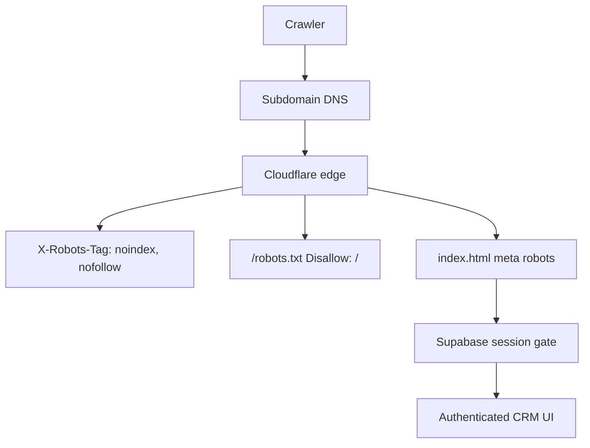

# Keep 100up CRM subdomain out of search

**Short answer:** Meta tags on the login screen help, but they are the weakest layer. Your CRM shell at `/` is a public HTML document ([`crm-100up/app/index.html`](f:\GIT_REPOS_INDIV\crm-100up\crm-100up\app\index.html)); Supabase login only hides app UI in JS — crawlers can still see and index that shell (title, login form markup). Neither CRM currently ships `robots.txt`, `noindex`, or `X-Robots-Tag`.

## What actually works (layered)



| Layer | Purpose | Strength |
|---|---|---|
| `X-Robots-Tag: noindex, nofollow` on all responses | Google/Bing respect this even without parsing HTML | Strongest SEO signal |
| `/robots.txt` with `Disallow: /` | Stops well-behaved crawlers from fetching pages | Strong; some bots ignore |
| `<meta name="robots" content="noindex, nofollow">` in [`index.html`](f:\GIT_REPOS_INDIV\crm-100up\crm-100up\app\index.html) | Backup if headers miss a path | Useful belt-and-suspenders |
| Auth (already have) | Hides client data; does **not** prevent indexing the login URL | Security, not SEO |
| Cloudflare Access (optional) | Blocks anonymous HTTP entirely | Security; overkill for SEO alone |

DNS / adding a subdomain in Cloudflare does **nothing** for crawlability by itself.

## Recommended setup for your stack

You deploy via Workers static assets ([`wrangler.jsonc`](f:\GIT_REPOS_INDIV\crm-100up\crm-100up\app\wrangler.jsonc)). Prefer **in-repo** controls so they travel with deploy:

1. **`public/_headers`** (or Workers equivalent under `dist`) so every asset/response gets:
   ```
   /*
     X-Robots-Tag: noindex, nofollow
   ```
   Docs: [Custom headers for Workers static assets](https://developers.cloudflare.com/workers/static-assets/headers/).

2. **`public/robots.txt`**:
   ```
   User-agent: *
   Disallow: /
   ```

3. **Meta in `index.html`**:
   ```html
   <meta name="robots" content="noindex, nofollow" />
   ```

**Dashboard alternative (no code):** Cloudflare → Rules → Transform Rules → Modify Response Header → hostname equals `crm.100up…` → set `X-Robots-Tag: noindex, nofollow`. Still add `robots.txt` + meta so non-proxied/edge-miss paths are covered.

## What not to rely on

- Login-page-only meta injected by React after hydrate — many crawlers only see the static `index.html` shell.
- “It’s behind a password” — the login URL itself is still public and indexable without directives.
- Hiding from sitemap only — CRM isn’t in a sitemap anyway; that doesn’t stop discovery via links, DNS, or `*.workers.dev`.

## After go-live hygiene

- Do **not** add the CRM hostname to Google Search Console / Bing as a property you want indexed.
- If it already appears: Search Console → Removals, plus keep `noindex` live so re-crawl drops it.
- Prefer a dedicated hostname (`crm.100up.com.au`) over leaving the default `*.workers.dev` URL discoverable without the same headers (apply the same rules there or disable public workers.dev if unused).

## Optional stronger gate

Cloudflare Zero Trust Access on the hostname blocks anonymous requests before HTML is served. That is access control, not an SEO substitute — still keep `noindex` if anything is briefly public (challenge pages, error pages).

---

**If you want this implemented next:** add `_headers`, `robots.txt`, and the meta tag in `crm-100up` (and mirror in BW-CRM if desired), then redeploy. No Cloudflare Access required for the indexing goal.