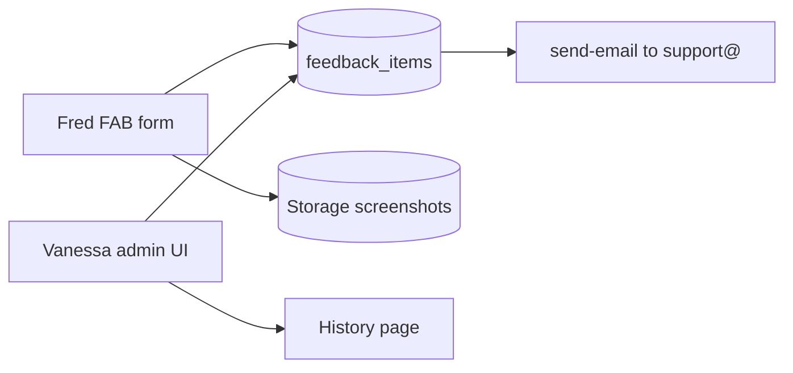
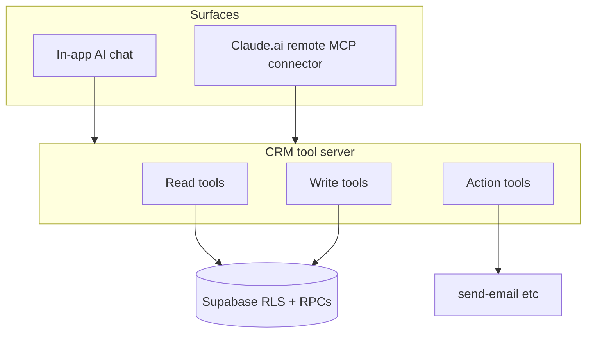

# Feedback desk + AI-in-CRM specs

Two docs only for now (no build until you approve after the specs). Both land under [`docs/`](F:/GIT_REPOS_INDIV/crm-100up/docs/) and get stub entries in [`docs/feature-wishlist.md`](F:/GIT_REPOS_INDIV/crm-100up/docs/feature-wishlist.md).

**Defaults locked for the specs:**
- Ticket status changes: Vanessa only, in-app as admin. Email to `support@brighterwebsites.com.au` is one-way notify with a deep link — no magic-link reply workflow.
- AI: in-app chat is the Fred-facing product; Claude.ai remote MCP is the same tool server exposed externally (not a separate product).
- Code/infra mutation (CF / Git / Supabase schema from chat): explicitly out of scope and explained to Fred in the AI doc.

---

## 1. Feedback desk (freeze-critical)

**Doc:** `docs/feedback-desk-design.md`

### Why
During V46 freeze / cutover, Fred needs a place to dump bugs and feature ideas that does not depend on WhatsApp or you remembering chat. You need status without turning it into a second project tracker.

### Product shape
- **Entry:** fixed bottom-right floating `[Bug]` / feedback button (always visible; does not fight Backup / Sign out in [`Shell.tsx`](F:/GIT_REPOS_INDIV/crm-100up/app/src/pages/Shell.tsx) header-right).
- **Log form (admin-only for v1):** type (`bug` | `feature`), title, details, auto-captured `screen` (= current `page` from Shell), optional screenshot upload.
- **Open list:** same panel — open + started + blocked only, newest first.
- **History:** separate out-of-the-way page (sidebar under Settings, or Settings tab “Feedback”) — all statuses including resolved; filter by type/status.
- **Statuses:** `open` → `started` → `blocked` | `resolved`. Only Vanessa (admin) changes status / adds a short admin note. Fred creates and reads; no installer access.

### Data
New migration (when built):
- `feedback_items` — `id`, `kind`, `title`, `details`, `screen`, `status`, `screenshot_path`, `created_by`, `created_at`, `updated_at`, `admin_note`, `resolved_at`
- Supabase Storage bucket `feedback-screenshots` (private; signed URLs; first Storage use in this project — none exists today)
- RLS: admin full; no `anon`; revoke-all-then-grant pattern (bugs.md #13)

### Notify
On create: Edge Function (or trigger via `send-email`) emails `support@brighterwebsites.com.au` with kind, title, screen, link into CRM Settings → Feedback. Uses existing CyberPersons `send-email` + `email_sends` log. No auto-email on status change (noise).

### Explicit non-goals
- Not a replacement for [`docs/bugs.md`](F:/GIT_REPOS_INDIV/crm-100up/docs/bugs.md) eng register — Vanessa still promotes anything that needs a code fix into `bugs.md` / wishlist when she starts work.
- No public/anonymous reports; no installer reports in v1.
- No Slack/Discord.

### Build order (noted in spec, not executed yet)
Ship **before or at freeze**, ahead of AI chat. Small, high leverage for cutover communication.

---

## 2. AI in the CRM (phased) + Claude.ai MCP

**Doc:** `docs/ai-in-crm-design.md`

### Current baseline
Already built: Anthropic via [`aiComplete`](F:/GIT_REPOS_INDIV/crm-100up/supabase/functions/_shared/ai.ts) → `extract-invoice` only; logged to `ai_call_log`; key in `integrations`.

### Answer on MCP (yes, viable)
Claude.ai (Free/Pro/Max/Team) supports **custom remote MCP connectors**: Customize → Connectors → Add custom connector → HTTPS MCP URL. Anthropic’s cloud calls the server (must be public HTTPS). Same connector can appear in Claude Code when signed in with that Claude.ai account.

So Fred can use his Claude.ai subscription against the CRM **if** we host a remote MCP server that exposes tools and authenticates him. This is the better path for “talk to my data with a strong chat UI” than trying to rebuild Cursor inside the CRM. It does **not** give him CF/Git/Supabase deploy powers unless we deliberately wire those tools (we will not).

### Architecture: one tool layer, two surfaces

Shared principles (aligned with BW-CRM AI Utility Layer ideas, not Hermes):
- **Rules before AI** — tools return structured data; model reasons; consequential writes go through existing SECURITY DEFINER RPCs / guards (`guard_jobs_update`, `guard_stock_qty`, etc.), never raw table patches from the model.
- Every model call still goes through `aiComplete` + `ai_call_log` when the CRM pays for tokens. When Claude.ai is the client, **Fred’s Claude subscription** pays for the model; the MCP server only executes tools.
- Admin-only until installer read RLS is fixed (bugs.md #14).

### Phases

| Phase | What Fred gets | Tools | When |
|---|---|---|---|
| **0** (done) | AI reads invoice → proposal | `extract-invoice` | Live |
| **1** | Chat about data: read, analyse, recommend — no writes | `list_tables` / `describe_table`, `query_*` (jobs, customers, stock, POs, pipeline, assumptions) with hard row limits and allowlisted columns | Post-cutover, after feedback desk |
| **1b** | Same tools via Claude.ai custom connector | Remote MCP (Streamable HTTP) on Cloudflare Worker or Supabase Edge, OAuth or long-lived admin token | Parallel to Phase 1 if he has Claude Pro/Max |
| **2** | Chat can update data | Narrow write tools mapped to existing RPCs (`set_step_date`, receive stock, update notes, …) with confirm-in-UI for in-app, and explicit tool confirmation for MCP | After Phase 1 trust |
| **3** | Action tools | `send_email`, draft CES summary, etc. | After Phase 2 |
| **Out of scope** | “AI updates the system” (edit app code, push Git, change Cloudflare, apply Supabase migrations) | None | Explain in Fred-facing wording in the doc |

### Why code/deploy-from-chat is out of scope
Document clearly for Fred: changing the running system needs repo review, migrations, RLS, deploy, and human judgment. Cursor / Claude Code already have those abilities locally. Wiring GitHub + Cloudflare + Supabase Management API into an in-browser agent is a large security and ops surface for little gain vs him asking you (or using Cursor with you). The MCP path can later add *data* and *business-action* tools; it should not become a deploy bot.

### In-app Phase 1 UI (sketch in doc)
- Sidebar item or header “Ask CRM” panel (admin).
- Chat thread stored in `ai_chat_threads` / `ai_chat_messages` (optional v1: session-only, then persist).
- Tool results rendered as compact tables; citations of which tool ran.
- Cost: CRM Anthropic key + existing Settings AI usage card.

### MCP server sketch (in doc)
- Public URL e.g. `https://mcp.offgridcrm.100up.com.au/mcp` (Cloudflare Worker preferred — already on CF — or Edge Function).
- Auth: OAuth 2.1 (Claude connector advanced settings) **or** v1 personal access token Fred pastes once (simpler; document rotation).
- Tool namespaced: `crm_list_jobs`, `crm_get_job`, `crm_list_stock`, … then later `crm_update_*`, `crm_send_email`.
- Rate limits + allowlist of tables/columns; never expose `integrations.secret`, raw `ai_call_log` prompts, or backup emails from `private.*`.

### Wishlist + MVP plan cross-links
- Add **W3 Feedback desk** and **W4 AI chat / MCP** entries to [`feature-wishlist.md`](F:/GIT_REPOS_INDIV/crm-100up/docs/feature-wishlist.md).
- One paragraph in [`docs/2026-09-20_mvp-plan.md`](F:/GIT_REPOS_INDIV/crm-100up/docs/2026-09-20_mvp-plan.md) under post-cutover: feedback desk can pull forward into freeze; AI chat stays post-cutover.

---

## Deliverables (this documentation pass)

1. Write `docs/feedback-desk-design.md`
2. Write `docs/ai-in-crm-design.md` (includes MCP answer, phases, out-of-scope deploy story for Fred)
3. Append W3/W4 stubs to `docs/feature-wishlist.md`
4. Short post-cutover note in MVP plan pointing at both specs

No migrations, UI, or MCP server in this pass.