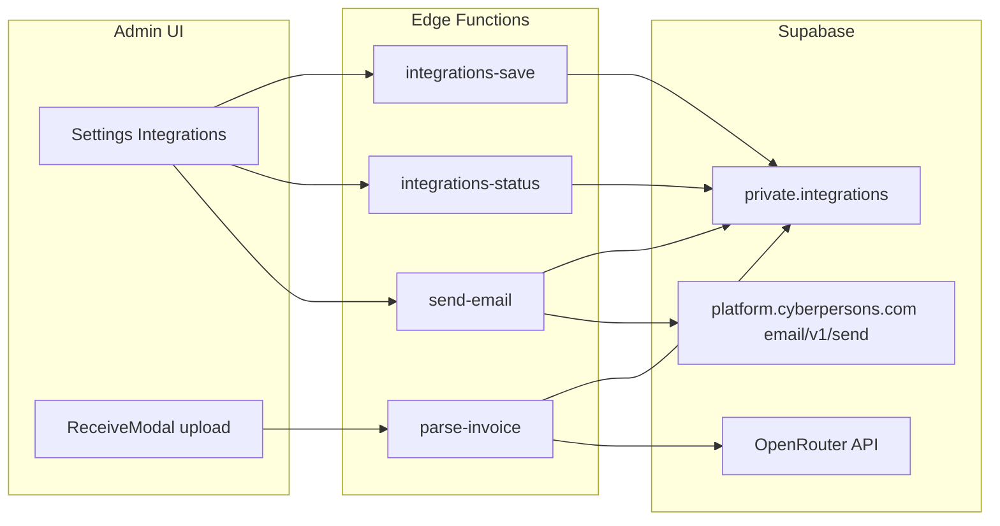

# Settings Integrations + OpenRouter Receive + Email

## Scope (this slice)

- Admin-only **Settings → Integrations**: OpenRouter (AI) + **CyberPanel Email Delivery** (platform.cyberpersons.com — not hosting SMTP)
- **Stock receive**: upload invoice → OpenRouter vision → existing match/review → `receive_stock`
- **Email**: save credentials + **Test send** Edge Function (no PO/CES wiring yet)
- **Out of scope**: chat UI, SMSBroadcast, new `office_admin` role, inbound email, SMTP

Roles stay `admin | installer`. Future office admin = new enum value + widen the same `private.is_admin()`-style gate (or a dedicated `can_manage_integrations()` helper). Installers never see Integrations.

## Architecture



Secrets never touch Vite or PostgREST SELECT. Admin pastes keys in Settings; Edge Functions read them with the service role after verifying `private.is_admin()` via the caller JWT. Same pattern as SCOS `Email_Delivery.php` — browser never calls CyberPersons directly.

## 1. Database: private integrations store

New migration under [`crm-100up/supabase/migrations/`](crm-100up/supabase/migrations/):

- Table `private.integrations`:
  - `provider text primary key` — `'openrouter' | 'email'`
  - `config jsonb not null default '{}'` — non-secrets (see Email / OpenRouter shapes below)
  - `secret text` — OpenRouter API key **or** CyberPersons `sk_live_…` (nullable when clearing)
  - `secret_last4 text`
  - `updated_at`, `updated_by` → `profiles`
- **No grants** to `anon` / `authenticated` / `public` on `private.integrations` (service role only)
- Prefer Edge Functions for status so the secret column is never on the Data API surface

Reuse existing [`private.is_admin()`](crm-100up/supabase/migrations/20260718090002_rls.sql) for auth checks inside functions.

## 2. Edge Functions

Beside the existing stub [`job-events-hook`](crm-100up/supabase/functions/job-events-hook/index.ts):

| Function | Auth | Behaviour |
|---|---|---|
| `integrations-save` | JWT + admin | Upsert provider config; if `secret` present, store and set `secret_last4`; if `clear_secret`, null secret |
| `integrations-status` | JWT + admin | Return `{ provider, configured, secret_last4, config }` — never raw secret |
| `parse-invoice` | JWT + admin | Load OpenRouter secret; call chat/completions with vision; return invoice JSON matching `ReceiveModal` shape |
| `send-email` | JWT + admin | Load email secret+config; `POST https://platform.cyberpersons.com/email/v1/send`; support test payload from Settings |

Shared helpers: verify admin from JWT, CORS, JSON errors.

**Deploy secrets (operator):** only Supabase `service_role` for the functions runtime — Fred’s OpenRouter key and the CyberPersons `sk_live_…` live in `private.integrations`, not Deno.env (differs from the generic SCOS “env checklist” snippet so Settings can manage them per CRM).

### OpenRouter (`provider = openrouter`)

- `secret` = OpenRouter API key
- `config`: `{ model: string }` — default a cheap multimodal model (e.g. `google/gemini-2.5-flash`), editable in Settings
- System prompt = invoice JSON contract from [`ReceiveModal.tsx`](crm-100up/app/src/features/stock/ReceiveModal.tsx)

### Email — locked to SCOS / CyberPersons (`provider = email`)

Port of WP `Email_Delivery` / `send_mail_payload` — **not SMTP**.

| Storage | Maps from WP | Notes |
|---|---|---|
| `secret` | `SE_EMAIL_API_KEY` / `se_email_api_key` | Bearer `sk_live_…` |
| `config.from_address` | `se_email_from_address` | **Bare address only** — `noreply@domain.com.au`, never `Name <email>` |
| `config.reply_to` | `se_email_reply_to` | Optional |
| `config.enabled` | `se_email_enabled` | Gate; test-send and future callers check this |

**Send contract** (Edge Function → CyberPersons):

```
POST https://platform.cyberpersons.com/email/v1/send
Authorization: Bearer <secret>
Content-Type: application/json

{ from, to, subject, html }  // html or text required
// optional: reply_to, cc, bcc, attachments [{ filename, content: base64 }]
```

**Success / failure** (mirror WP client):

- HTTP 200 + `{ success: true, data: { message_id, status } }` → OK
- HTTP 200 + `success: false` → treat as failure
- Non-2xx / `domain_not_verified` / `invalid_request` → surface message in Settings test UI

**Prerequisites** (document in Settings help text; don’t encode as magic):

- Account at platform.cyberpersons.com/email (separate from CyberPanel hosting)
- Domain verified (DNS TXT) — else `403 domain_not_verified`
- API key with `can_send`
- `from` domain must be the verified domain (not Gmail)
- Body must include `html` or `text`

**Email schema lock:** done. No curl/smoke required from Vanessa for planning; optional live curl against the 100UP from-domain before go-live is operator QA, not a plan blocker.

## 3. Settings UI

Replace Settings stub in [`Shell.tsx`](crm-100up/app/src/pages/Shell.tsx) (`page === 'settings'`) with a real page, e.g. [`app/src/pages/SettingsPage.tsx`](crm-100up/app/src/pages/SettingsPage.tsx):

- Section **Integrations** (admin already gated by Shell)
  - **AI (OpenRouter):** API key (write-only), `••••{last4}`, model field, Save, Clear key, link to openrouter.ai
  - **Email (CyberPanel Email Delivery):** API key (write-only), from (bare), reply-to, enabled toggle, Save, **Send test email** (to admin’s address or typed `to`); short note on verified domain + bare `from`
- Same CRM styling

## 4. ReceiveModal: upload path

Update [`ReceiveModal.tsx`](crm-100up/app/src/features/stock/ReceiveModal.tsx):

- Primary path: file input (image + PDF) → `parse-invoice` → existing review state
- Keep **manual JSON paste** as fallback
- Replace “upload to any Claude chat” copy
- If OpenRouter not configured → point to Settings → Integrations
- PDF: client-side first-page → JPEG (pdf.js); photos as base64 (no Storage bucket for MVP)

Review UI + `receive_stock` RPC unchanged.

## 5. Roles / access

- No `user_role` change now
- Settings + all integration Edge Functions: admin only
- Note for later: `office_admin` can share the integrations gate without full admin if privileges split

## 6. Types / client

- Private table need not appear in client types
- Helper e.g. `app/src/lib/integrations.ts` — `invoke('integrations-status' | …)` with session JWT

## Implementation order

1. Migration `private.integrations`
2. Edge Functions: save + status
3. Settings Integrations UI (both providers)
4. `parse-invoice` + ReceiveModal upload
5. `send-email` (CyberPersons POST) + Settings test button
6. Smoke-test: OpenRouter parse → review → receive; email test-send

## Risks (acknowledge, don’t over-build)

- Invoice layout variance → keep human review
- PDF multi-page → MVP first page only
- Email: wrong `from` format or unverified domain → clear Settings errors (same failure modes as WP)
