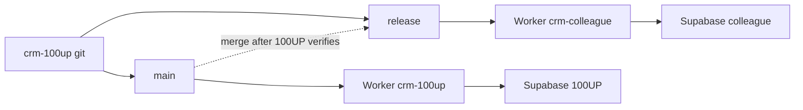

# Second-company deployment plan (document only)

Write [`docs/2026-09-20_second-deployment.md`](docs/2026-09-20_second-deployment.md) in `crm-100up`. Add one row to the “Read these before starting work” table in [`CLAUDE.md`](CLAUDE.md) so later sessions see it. No Workers, Supabase projects, or brand-config code in this pass.

## Intent (lock this at the top of the doc)

Fred owns the product. He wants a **colleague who does similar solar installs** on a second instance to:

- test whether this is something he can sell
- collect feedback
- shape a later licence

The colleague is a **design-partner / trial licensee**, not a production customer and not a BW product. Vanessa operates the second instance; Fred is the licensor.

Gate: **do not cut the colleague over until Fred is living in this CRM** (quote loop closed in Sprint 1; Sprint 3 hardening still open — installer read leak, Auth SMTP, API keys, import). A second live tenant on an unfinished first tenant multiplies support, not feedback quality.

## Recommended shape (what we already decided)

One git. Two Cloudflare Workers. Two Supabase projects. Staggered promote.

- **100UP Worker** ([`app/wrangler.jsonc`](app/wrangler.jsonc) `name: crm-100up`) auto-deploys from `main` with existing `VITE_SUPABASE_*` build vars → `offgridcrm.100up.com.au`.
- **Colleague Worker** is a second Worker on the **same GitHub repo**, production branch `release`, its own `VITE_SUPABASE_URL` / `VITE_SUPABASE_PUBLISHABLE_KEY`, its own hostname.
- **Colleague database** is a **new** Supabase project: same migrations (`supabase db push` against the second link), same Edge Functions, **empty data**. Never clone 100UP jobs, customers, assumptions, or `planning_cost` / `last_cost` — that is Fred’s pricing.
- **Do not** fork a second git. **Do not** share one DB with `tenant_id`. Staged rollout is a branch problem, not a repo problem.

Cloudflare already supports connecting one repo to two Workers with different production branches and build env vars ([Workers Builds advanced setups](https://developers.cloudflare.com/workers/ci-cd/builds/advanced-setups/)).

## What is already per-tenant vs still 100UP-hardcoded

**Already in the DB (colleague types their own):** stock, assumptions, pipeline step dates, suppliers, users, integration rows.

**Still in the SPA (needs a small `VITE_BRAND_*` config before they log in):**

- Nav / login: [`app/src/pages/Shell.tsx`](app/src/pages/Shell.tsx), [`Login.tsx`](app/src/pages/Login.tsx), [`SetPassword.tsx`](app/src/pages/SetPassword.tsx), [`app/index.html`](app/index.html)
- POs, stock-take sheet, export filenames, email subjects: [`features/jobs/actions.ts`](app/src/features/jobs/actions.ts), [`stockTake.ts`](app/src/features/stock/stockTake.ts), [`poActions.ts`](app/src/features/stock/poActions.ts)
- Quote paste type `100up-quote`: [`lib/quotePayload.ts`](app/src/lib/quotePayload.ts)
- Gmail callback hostname: Edge secrets `CRM_APP_URL` / `GMAIL_OAUTH_REDIRECT_URI` ([`gmail-oauth-callback/index.ts`](supabase/functions/gmail-oauth-callback/index.ts))

**Product-logic risk (not branding):** [`app/src/lib/solarJuly.ts`](app/src/lib/solarJuly.ts) is Ballarat July W/kW. If the colleague quotes a different climate, the battery size is wrong. Call that out; do not “fudge” the array. A second location dataset is later product work.

## Risks and mitigations (main body of the doc)

| Risk | Why it bites | Mitigate |
|---|---|---|
| Colleague on unfinished product | Sprint 3 still open ([`docs/2026-09-20_mvp-plan.md`](docs/2026-09-20_mvp-plan.md)): bug #14 installer reads, Auth SMTP, keys, import | 100UP canary first. Colleague instance only after Fred has used the quote→job path for real jobs. Time-box the trial. |
| They inherit Fred’s process, not a generic CRM | 19-step pipeline, Deye/Sigenergy/CEC, off-grid July sim | Brief them: “this is 100UP’s workflow.” Capture “we work differently” as licence-product feedback, not as forks in `main`. |
| Pricing leak | Copying `assumptions` / stock costs gives them Fred’s supplier numbers | New project, migrations only, empty catalogue. They enter their own parts and costs. |
| PII / dummy-email testing | 100UP customer emails are test aliases | Colleague DB is theirs from day one. No restore-from-100UP. |
| Bug #14 if they have installers | Authenticated users can read costs via API | No installer logins on the trial until #14 is closed — or admin-only trial. |
| Dual schema | `main` frontend vs `release` frontend | Apply migrations to 100UP first, verify, then colleague. No column drops / RPC breaks until both Workers are on the new frontend. |
| Free-tier pause | Two projects, two 7-day clocks | Pro on anything they depend on; at minimum a heartbeat. Trial dying mid-week poisons the “can I sell this” test. |
| Hostname-bound integrations | Gmail OAuth, email from-address, Anthropic key | Per-project secrets. Their Google OAuth client + redirect. Email from their domain. |
| Support / who pays | Two Workers is cheap; two DBs + you on-call is not | Written: Fred is licensor; Vanessa operates both; hosting + hours billed to Fred (or he bills the colleague). Trial ≠ unpaid SaaS. |
| Feature-contamination | Colleague asks for panels-only / different pipeline | Park on a feedback list. Ship to `main` only if it is also true for Fred. Config > forks. |
| Ballarat yield dataset | Mis-size if they are not in the same climate | Disclose. If they are not western VIC, either same-region trial only, or delay until a location dataset exists. |
| Legal / IP | Feedback session without a licence is still a copy of the product | Short trial letter: Fred owns code and method; time-boxed; no sublicence; their data stays theirs; they do not get a git clone unless you later choose that model. |

## Near-term steps when Fred says “do it” (checklist in the doc, not this PR)

1. Trial letter signed.
2. Brand config (`VITE_BRAND_NAME`, legal line, quote type) so they do not log into “100UP”.
3. New Supabase project; `db push`; deploy Edge Functions; their keys.
4. New Worker; custom domain; build vars; production branch `release`.
5. Seed: admin user + empty stock/assumptions — they type the catalogue.
6. Admin-only until bug #14 is closed.
7. Feedback log (what they liked / what is “too 100UP”) — feeds a later licence, not a second git.

## Sidebar only: hybrid open-source / AI-fork (one short section)

Not the trial model. The colleague should get a **hosted instance of Fred’s app**, not a fork they maintain.

The idea (source-available starter + AI that watches upstream and warns when customisations block updates) is a known shape: WordPress/Cal.com-style source-available, plus a compatibility contract. It becomes relevant **if** later licensees self-host and customise.

If that path is ever real:

- Split “extension surface” (brand, catalogue, assumptions, location dataset) from “core” (stock RPCs, RLS, pipeline gates).
- A `COMPAT.md` / agent doc that lists which files are safe to edit vs which make `git merge origin/main` unsafe.
- AI can **advise** (“you touched `quoteEngine.ts`; this upstream change will conflict”) — it cannot keep two diverging products merge-safe.

Wrong now because: the trial is about whether Fred’s *process* sells, not whether a stranger can white-label the repo. Open-sourcing the quoting logic is a separate Fred licence decision; “hybrid OSS” usually means source-available + commercial licence, not GPL.

## Out of scope for the file

Standing up the second Worker, the second Supabase project, or implementing `VITE_BRAND_*`. Those wait on Fred’s go + the canary gate above.
